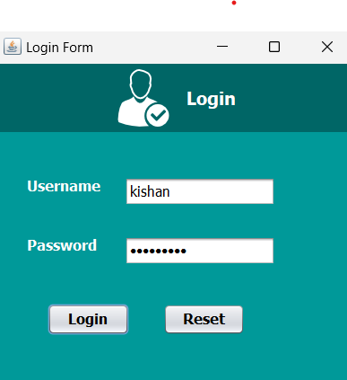
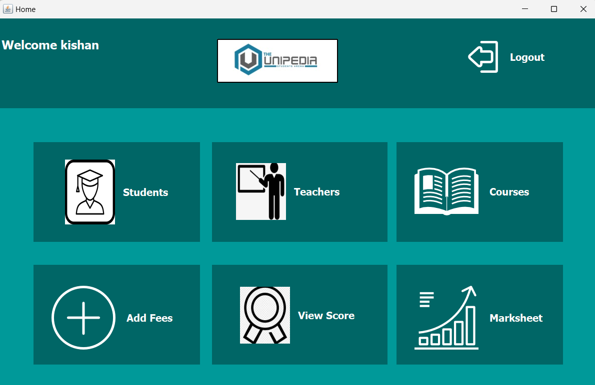
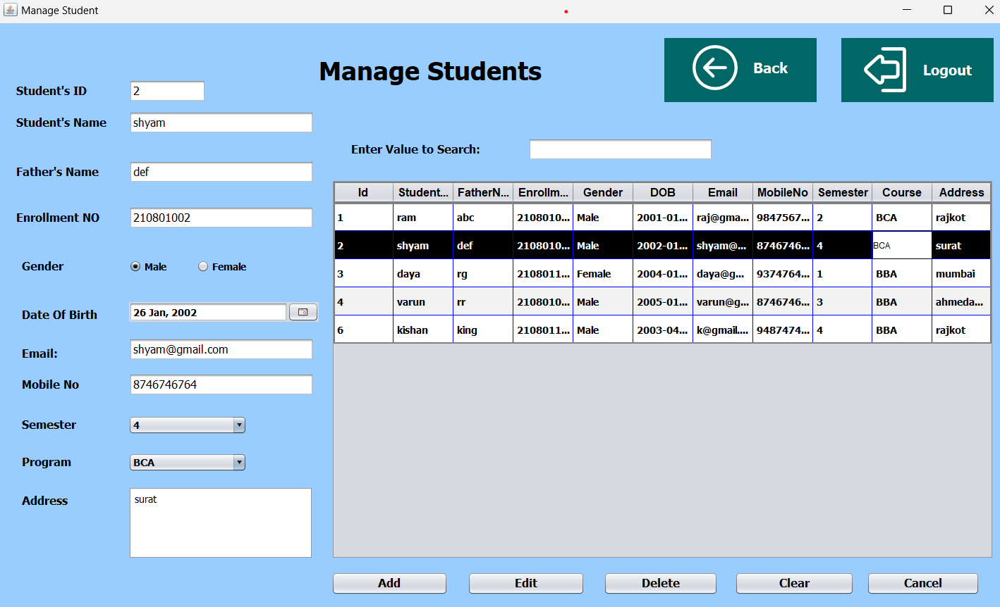
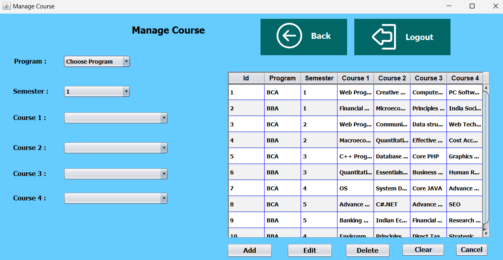
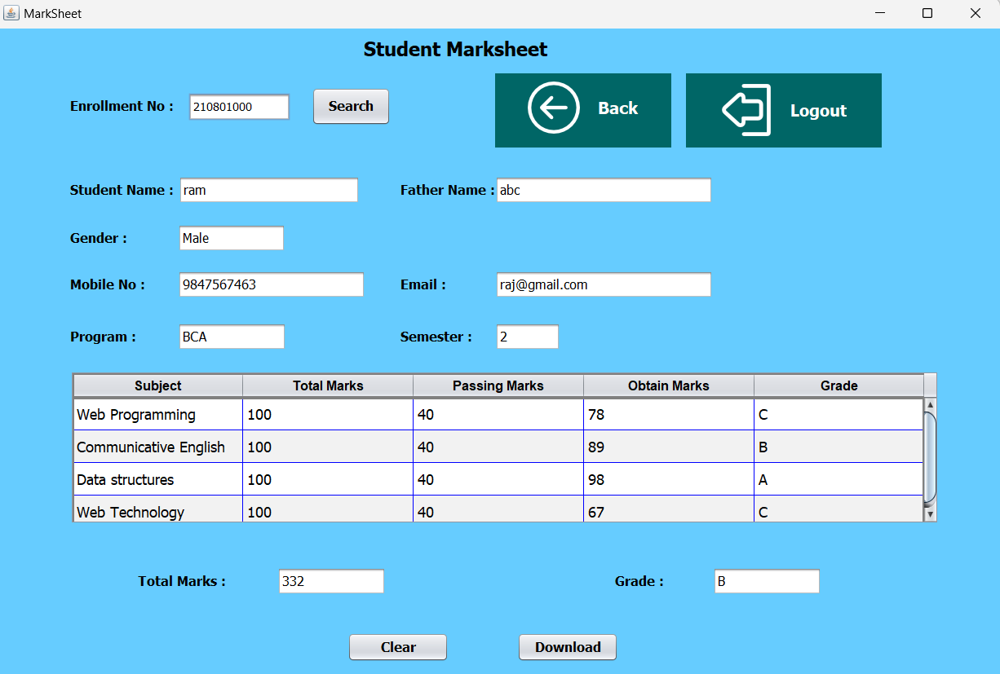

# UniPedia -- University Management System

  This project is a Java-based University Management System (UMS) developed using Java Swing for the graphical user interface (GUI).  The system allows administrators to manage student records, course details, faculty information, and more.
# Features
  - Add - View - Edit and Delete Students - Faculty - Courses - Score
  - Marksheet and Fee Download in PDF
  - Admin Login - Details
  - Information of different type Programs & Semester Courses
  -  JTable Integration for Data Presentation

# Technologies Used
 - Java SE (Swing API) for GUI development
 - JDBC (Java Database Connectivity) for database interaction
 - MySQL database for data storage

# Setup Instructions
 1. Clone the Repository: 

        git clone https://github.com/KishanGinoya/UniPedia.git
 2. Import Project into IDE: 

    Open the project in your preferred Java IDE (e.g., IntelliJ IDEA, Eclipse,Netbeans IDE). 
  3. Set Up Database: 

     Install MySQL and create a new database named javaproject. 
     Import the database schema from database/javaproject.sql. 

 4. Run the Application: 

    Run the java file to start the application. 

# ScreenShots
  <b>*Login Screen*<b> 
   

  *Home Screen* 
   

  *Student Screen*  Add , update , delete , display , select , clear 
   

  There are similar page of teacher for add , update , delete and display. 

  *Course Screen*  Add , update , delete , display , select , clear 
   

  there are also page for add ,update ,delete and display score of students. 
  also fee page available to pay and download fee. 

  *Marksheet Screen*  
   

# Contributing
  Contributions to this project are welcome. Feel free to open issues, submit pull requests, or suggest improvements.
  
  
